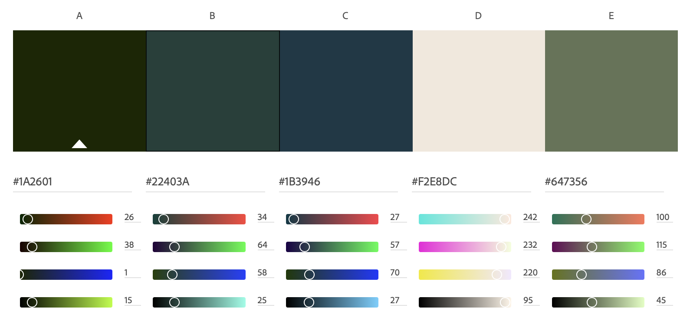

# About Me Project

Welcome! Welcome! I'm Juvina Thaker and this is my finals project from my Web Dev 1 class. 

## Color Palette

| Color             | Hex                                                                |
| ----------------- | ------------------------------------------------------------------ |
| Dark Green | #22403A|
| Dark Teal | #1A2601 |
| Teal |#1B3946|
| Cream| #f2e8dc |
| Light Green | #647356 |

## Color Scheme 
 The color scheme I used for the site:

# Websited Used
The following websites were used:
* [Adobe color selector](http://color.adobe.com/) - color selector tool
* [Netlify](https://Netlify.com) - Netlify for hosting and serverless backend services for web applications.
* [Google Fonts](fonts.Google.com) - Wide variety of usable fonts
* [Github](https://github.com) - Cloud based website to connect all your work

## Navigation Bar

I learnt that in CSS, the navigation bar is typically created as a horizontal list of links, and that this list can be styled using CSS to control the appearance of the navigation bar, including its fonts, colors, and layout. 

## Logo

I learnt about the process of creating a logo, which is the process of designing a unique and recognizable symbol or design that represents a brand or company.

## Bio & Hobbies

I wnjoyed this part since I had to write about myself!!

## Image Gallery

To create an image gallery in CSS, you can use the img HTML tag to insert the images into the page, and then use CSS to control the appearance of the images and the gallery as a whole. 

## Hover effect with hyperlinks

For Hover Image, I used the :hover selector in your CSS to specify the styles for an element when the user hovers over it. For example, if you have a 
 element with the class "hover-me"

To create a hyperlink in HTML, you can use the <a> element. The href attribute of the <a> element specifies the destination of the link. 

## Video

I made a video and embedded and syled it using css

## License

[MIT](https://choosealicense.com/licenses/mit/)